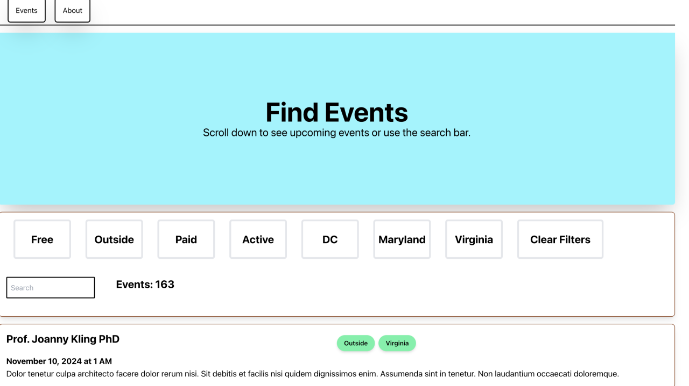

I moved back to DC close to where I grew up and recently read that it was the [loneliest city in the USA](https://www.google.com/search?q=loneliest+city+in+the+usa). 

To change that, I decided to make an app that would display events, allow users to submit their own events, have an admin panel to edit events, and to top it all mobile apps along with it. I called the Project How-I-Met-You (complete source code is at the bottom :)

The Technologies I used for the project were:

- Laravel (for API development)
- Inertia for (Desktop Frontend)
- React (Frontend)
- React Native/Expo (Mobile Development)
- Digital Ocean (For Hosting)
- Laravel Forge (For Deploying)
- MYSQL (Database)
- Filament (Admin Panel Builder)
- Swagger (API documentation)
- Tailwind (CSS Styling)
- Pest (Testing)
- AWS S3 (For Image Storing)

Let's get started developing :)

 I started with the backend API. The most important thing was making the API able to easily filter and query despite each model having different fields.

```php

abstract class QueryFilter
{
    protected $builder;

    protected Request $request;

    public function __construct(\Illuminate\Http\Request $request)
    {
        $this->request = $request;
    }

    public function apply(Builder $builder): Builder
    {
        $this->builder = $builder;

        foreach ($this->request->all() as $key => $value) {
            if (method_exists($this, $key)) {
                $this->$key($value);
            }
        }

        return $builder;
    }
}


```


The Above class looks throw any requests parameters and tries to build a query out of them if the method exists. So if I subclass the method like below:

```php

class EventFilter extends QueryFilter
{
    public function tags($value): Builder
    {

        if (! $value) {
            return $this->builder;
        }

        return $this->builder->whereHas('tags', function ($q) use ($value) {
            $q->whereIn('name', explode(',', $value));
        });
    }

    public function searchName($value)
    {
        return $this->builder->where('name', 'like', "%{$value}%");
    }
}

```

You can then provide a query: /api/events?tags=['free','outside']&searchName=BBQ

and the filter will look for those keys as methods and attempt to query by their defined methods

# Controllers
Most of the controller methods are fairly simple (I have the full source code at the bottom of the article linked) but I will walk you through the most important method the GET request for all the events


```php
 public function index(Request $request, EventFilter $filter)
    {
        $events = Event::query();

        $events = $filter->apply($events)->with(['tags', 'socials', 'locations'])->inFuture()->paginate(Event::PAGINATION_SIZE);

        return response()->json($events);
    }

```
this request paginate the requests by a constant, uses a scope I made which only gets events in the future which is after the time of the request and also attaches the tags, social media, and locations of the event which can vary from 0 to many.

# Testing
I used Pest to create tests and it couldn't be easier once you get the hange of it. You can use it easily to check for custom JSON response amongst a list ofJSON.

```php
test('guest can retrieve all events with tag and socials', function () {
    $user = User::factory()->has(Event::factory()->hasTags(1)->hasSocials(2)->futureDates()->count(5))->create();
    $response = $this->actingAs($user)->get('/api/events');

    $response->assertOk();
    $response->assertJson(fn(AssertableJson $json) => $json->has('data', 6)->etc());
    $response->assertJson(fn(AssertableJson $json) => $json->where('data.0.tags.0.name', Event::inFuture()->first()->tags->first()->name)->etc());
    $response->assertJson(fn(AssertableJson $json) => $json->where('data.0.socials.0.url', Event::inFuture()->first()->socials->first()->url)->etc());
});
```
The etc() method is really important because it only looks for specific JSON instead of comparing it to everything else.


# Filament


If you have never used Filament before, it's awesome. it allows you to make admin panels with ease and has great documentation. From this panel, I can give anyone login information and they can then customize events add new ones, or delete them to their hearts content.

You can easily make custom tables and forms that outlines what an admin can't and cannot do and Filament will automatically update the database accordingly


```php
 public static function form(Form $form): Form
    {
        return $form
            ->schema([
                Forms\Components\Section::make()
                    ->schema([
                        Forms\Components\Checkbox::make('enabled'),
                        Forms\Components\TextInput::make('name'),
                        Forms\Components\Textarea::make('description'),
                        Forms\Components\DateTimePicker::make('date'),
                        Forms\Components\TextInput::make('url')->label('Website URL'),
                        Forms\Components\TextInput::make('image_url')->label('Image URL'),
                    ])
                    ->columns(1),

            ]);
    }
```
The above example makes a table for events using the actual model attributes.


# React
I decided to use React for a few reasons over Vue:

I wanted to create an app for react-native and that needed react so I didn't want to be using different frameworks and rewrite the same thing.
It is more widely used, has more documentation than other 

I loved the component design that React has (other frameworks have it as well), but it makes sense to break down your front end peices into smaller and smaller chunks so you can reuse them where necessary.

This allowed me to break down the Web App into several components

- Event List
- Event Filter
- Event (a singular event)
Navbar

I also learned how to take advantage of my Backend API, which used pagination. It would not query my whole events table but only 15 records at a time. What is happening is that when you scroll to the bottom of the page, React requests the next page and adds it to the list so the user experiences the iconic endless scroll

```js
useEffect(() => {
    const observer = new IntersectionObserver(
        (entries) => {
            if (entries[0].isIntersecting) {
                getMoreEvents(true);
            }
        },
        { threshold: 0.1 },
    );

    if (ref.current) {
        observer.observe(ref.current);
    }

    return () => {
        if (ref.current) {
            observer.unobserve(ref.current);
        }
    };
}, [ref, params]);
```

The code above lists for the user to make it to the bottom of the page (or they can see the bottom tenth of it). When it does it calls another method called getMoreEvents() which calls the paginated page + 1 and requests it. This way we are not always asking for all events at all times.


# React Native
The beautiful part of building a react native and the web facing API with react is that it is very simple to make an app for mobile, simply tweak your components so that they are styled correctly on mobile and viola.

I had to do some work to make the scrolling work using different build in features (READ the documentation to see what components are build for you in react-native out of the box)


I'm not a design expert, ok?
So now came using the same API to fetch the events and implement them in a mobile view. This time I made the location, time, and truncated description the biggest thing and had the tag filter as a side panel so there was not too much on the main screen. 

# Uploading to S3
The big thing I wanted to do was have the ability for anyone to create an event, and then have an admin (probably me) approve it on the admin panel (remember filament) so I made a submission screen for anyone to post an event that by default would be disable and would have to be enabled by an admin.

The form here has requirements and if rejected by the API, it will display the errors (such as no name or description).

The image creation automatically uploads an optional picture to an S3 bucket so it's seen on the backend and can be viewed by user's if its approved.


# Actual event
Once an event is approved, this is what it would look like when you clicked into it displaying all the information and a share button that only shares via text (for now)


# Deployment
The deployment phase has two pipelines:
- pint (a php linter) that must pass
- all tests must pass for a valid deployment

when the code is pushed to Github Laravel Forge picks it up (this is the only paid service I used in making this, other than the fees for releasing apps on the iOS and Android app stores) and deploys it, remember to use your own environment variables as well as build the app properly if your using Inertia

I had to add npm commands for my deployment script:

```bash
cd /home/forge/default
git pull origin $FORGE_SITE_BRANCH

$FORGE_COMPOSER install --no-dev --no-interaction --prefer-dist --optimize-autoloader


$FORGE_COMPOSER install

( flock -w 10 9 || exit 1
    echo 'Restarting FPM...'; sudo -S service $FORGE_PHP_FPM reload ) 9>/tmp/fpmlock

#if [ -f artisan ]; then
    $FORGE_PHP artisan migrate:fresh --force
    $FORGE_PHP artisan db:seed --force
    
#fi

npm install
npm run build

$FORGE_PHP  artisan cache:clear
$FORGE_PHP  artisan config:clear
```

# Improvements

I could improve documentation further, I have started documenting the API in Swagger but I have a way to go
Look into Kubernetes for scaling purposes
Possible improved query performance

Thank You
Does this project truly solve the loneliness epidemic? no, but anything to get people more connected is worth a shot. If you have a better idea. Let me know.

Thank you for reading to the end, the fully available source code is below in two repositories:

- [How-I-Met-You](https://github.com/ajn123/How-I-Met-You)
- [How-I-Met-You-Mobile](https://github.com/ajn123/How-I-Met-You-Mobile)

The next project I will be working on is a non-profit dating app.