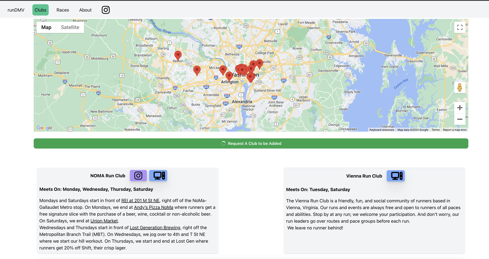
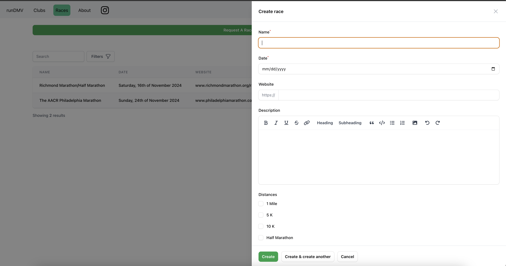

# How I Created an app to display run clubs in the DMV

- Here is the [Github Project](https://github.com/alexnorton/rundmv)
- Here is the live site [www.rundmvrun.com](https://rundmvrun.com)

There is an estimated 40 run clubs in the DMV area.  I wanted to create a website that would display all of them and allow users to submit their own clubs.  Then I could approve them as well as display them on a map.  I also wanted to make sure everyone knew how to contact them.


## Styling links
I wanted to  use Laravel Livewire to create a form to submit a run club.  I also wanted to use Filament to create an admin panel to approve the run clubs.  I also wanted to make sure the website was styled nicely. 

The first thing I was make an attribute for my Club model that would just store the id of the string and then I would use the Attribute::make() method to style the links.  Below is an example:

```php

    public function website(): Attribute
    {
        return Attribute::make(
            set: function ($value) {
                if (Str::startsWith($value, 'https://')) {
                    return Str::after($value, 'https://');
                }
                return $value;
            }
        );
    }

    public function instagram(): Attribute
    {
        return Attribute::make(
            set: function ($value) {
                if (Str::startsWith($value, 'https://www.instagram.com/')) {
                    return Str::after($value, 'https://www.instagram.com/');
                }
                return $value;
            }
        );
    }
    
```

## Race/Club Submission


To allow users to submit their own races and clubs, I created a form using Laravel Livewire.  This allowed me to easily add validation to the form and display errors to the user.  These submissions would be sent to the Filament admin panel where I could approve them.  By default, the model attributes would be set to false.  Once approved, the admin would set the attributes to the correct values.


## Using enums
For races, distances are often very specific.  I created an enum to store the distances and then a method to get the label.  This allowed me to easily display the distance in the frontend.  If any distances want to be added in the future, it's as easy as adding them to the enum.

```php

    enum Distances: string implements HasLabel
    {
        case Mile = '1 Mile';
        case Fivek = '5k';
        case Tenk = '10k';
        case HalfMarathon = 'Half Marathon';
        case Marathon = 'Marathon';
        case Ultra = 'Ultra Marathon';
        case Special = 'Special Disance';

        public function getLabel(): ?string
        {
            return match ($this) {
                self::Mile => '1 Mile',
                self::Fivek => '5 K',
                self::Tenk => '10 K',
                self::HalfMarathon => 'Half Marathon',
                self::Marathon => 'Full Marathon',
                self::Ultra => 'Ultra Marathon',
                self::Special => 'Unique Distance'
            };
        }
    }

```

## Future Improvements

Future improvements could be to allow users to submit their own races and clubs.  This would allow for more accurate and up to date information.  It would also allow for more races and clubs to be added.

- creating a modal to show the run clubs on the map.
- improve testing (backend and frontend)
- improve styling
- improve performance
- add analytics

Thanks for reading!