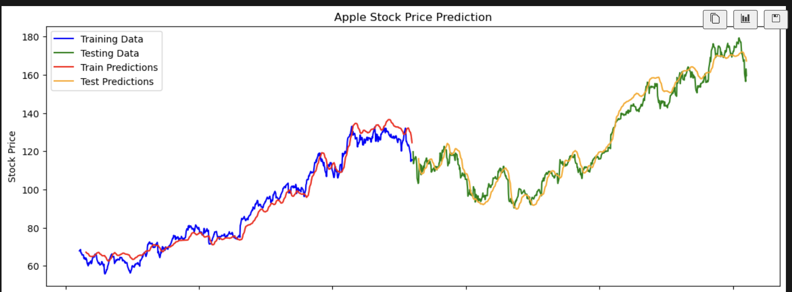

This weekend I wanted to dive more into Pytorch (which I love) and see if I could build a model to predict the stock market.  I have seen a few models online that claim to predict the stock market, but I wanted to see if I could build my own.  I also wanted to get more practice with Pytorch.





The first step is to understand how an LSTM works.  An LSTM is a type of Recurrent Neural Network (RNN) that is used for time series prediction.  It is a type of RNN that is able to learn and remember over time.  It is able to do this by having a memory cell that is able to store information from previous time steps.  This allows the LSTM to learn and remember over time.

We can then train it on a dataset and use it to make predictions.  We can do this by creating a sequence of data and training the LSTM on that sequence.  In this case we use 10 prior days of data to predict the next day's stock price.

The potential problems with the model are that it is only as good as the data it is trained on.  **If the data is not representative of the future then the model will not be able to make accurate predictions.**  It is also only as good as the features it is trained on.  If the features do not contain important information then the model will not be able to make accurate predictions.

Feature improvements could be adding more features to the model.  We could add the moving average, Bollinger Bands, RSI, MACD, and other technical indicators to the model.  We could also add more data to the model.  We could add more days of data to the model to see if it improves the accuracy of the model.

Another important thing to understand is the array formatting of the data.  The LSTM model expects the data to be in a specific format.  The data should be in the format of [batch_size, time_step, features].  This is because the LSTM is a sequence model and it needs to be able to process the data in a sequence.


I put everything in a function so that I could easily run it for different stocks.  Here is the code for the function:

```python

import pandas as pd
import numpy as np
import matplotlib.pyplot as plt
from sklearn.preprocessing import MinMaxScaler
import torch
import torch.nn as nn
import torch.optim as optim


def run_model_with_all_features(stock_name='Apple', stock_symbol='AAPL', prediction_column='close',  time_step=10, train_size=0.75, hidden_size=50, num_epochs=50, batch_size=32, learning_rate=0.001, graph=True, criterion=nn.MSELoss()):
    # Load the stock data
    all_stocks = pd.read_csv('./all_stocks_5yr.csv')
    apple_only = all_stocks[all_stocks['Name'] == stock_symbol]

    # Set the date as the index
    apple_only['date'] = pd.to_datetime(apple_only['date'])
    apple_only.set_index('date', inplace=True)

    # Use all features for prediction (excluding 'Name' and 'date')
    features = apple_only.drop(columns=['Name'])
    data = features


    prediction_column_index = features.columns.get_loc(prediction_column)

    # Split the data into training and testing sets
    train_size = int(len(data) * 0.5)
    train_data = data[:train_size]
    test_data = data[train_size:]

    # Normalize the data
    scaler = MinMaxScaler(feature_range=(0, 1))
    train_data_scaled = scaler.fit_transform(train_data)
    test_data_scaled = scaler.transform(test_data)

    # Create sequences for LSTM
    def create_dataset(data, time_step=1):
        X, y = [], []
        for i in range(len(data) - time_step - 1):
            X.append(data[i:(i + time_step), :])  # Use all features
            y.append(data[i + time_step, prediction_column_index])  # Assuming 'close' is the 4th column (index 3)
        return np.array(X), np.array(y)

    # Set the time step
    time_step = 10
    X_train, y_train = create_dataset(train_data_scaled, time_step)
    X_test, y_test = create_dataset(test_data_scaled, time_step)

    # Reshape input to be [samples, time steps, features]
    X_train = X_train.reshape(X_train.shape[0], X_train.shape[1], X_train.shape[2])
    X_test = X_test.reshape(X_test.shape[0], X_test.shape[1], X_test.shape[2])

    # Convert to PyTorch tensors
    X_train_tensor = torch.FloatTensor(X_train)
    y_train_tensor = torch.FloatTensor(y_train)
    X_test_tensor = torch.FloatTensor(X_test)
    y_test_tensor = torch.FloatTensor(y_test)

    # Define the LSTM model
    class LSTMModel(nn.Module):
        def __init__(self, input_size, hidden_size, num_layers):
            super(LSTMModel, self).__init__()
            self.lstm = nn.LSTM(input_size, hidden_size, num_layers, batch_first=True)
            self.fc = nn.Linear(hidden_size, 1)

        def forward(self, x):
            out, _ = self.lstm(x)
            out = self.fc(out[:, -1, :])  # Get the last time step
            return out

    # Hyperparameters
    input_size = X_train.shape[2]  # Number of features
    num_layers = 2
    learning_rate = 0.001

    # Create the model
    model = LSTMModel(input_size, hidden_size, num_layers)

    # Loss and optimizer
    optimizer = optim.Adam(model.parameters(), lr=learning_rate)

    # Train the model
    for epoch in range(num_epochs):
        model.train()
        optimizer.zero_grad()
        outputs = model(X_train_tensor)
        loss = criterion(outputs, y_train_tensor.view(-1, 1))
        loss.backward()
        optimizer.step()
        
        if (epoch + 1) % 10 == 0:
            print(f'Epoch [{epoch + 1}/{num_epochs}], Loss: {loss.item():.4f}')

    # Make predictions
    model.eval()
    train_predict = model(X_train_tensor).detach().numpy()
    test_predict = model(X_test_tensor).detach().numpy()

    # Inverse transform the predictions
    # Concatenate the predictions with the original scaled data for inverse transformation
    train_predict_full = train_data_scaled[time_step+1:]
    train_predict_full[:, prediction_column_index] = train_predict.flatten()
    test_predict_full = test_data_scaled[time_step+1:]
    test_predict_full[:, prediction_column_index] = test_predict.flatten()

    # Inverse transform the predictions
    train_predict_inverse = scaler.inverse_transform(train_predict_full)[:, prediction_column_index]  # Get the 'close' column
    test_predict_inverse = scaler.inverse_transform(test_predict_full)[:, prediction_column_index]  # Get the 'close' column

    # Plot the results
    plt.figure(figsize=(14, 5))
    plt.plot(data.index[:train_size], train_data['close'].values[:train_size], label='Training Data', color='blue')
    plt.plot(data.index[train_size :], test_data['close'].values, label='Testing Data', color='green')
    plt.plot(data.index[time_step+1:train_size], train_predict_inverse, label='Train Predictions', color='red')
    plt.plot(data.index[train_size + time_step + 1:], test_predict_inverse, label='Test Predictions', color='orange')
    plt.title(f'{stock_name} Stock Price Prediction')
    plt.xlabel('Date')
    plt.ylabel('Stock Price')
    plt.legend()
    plt.show()


```

